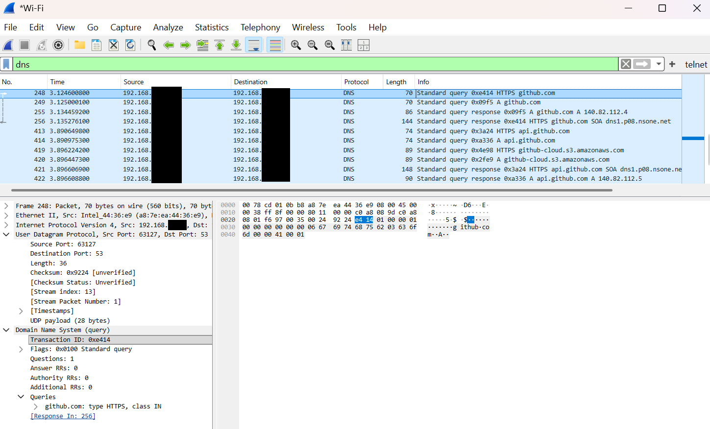
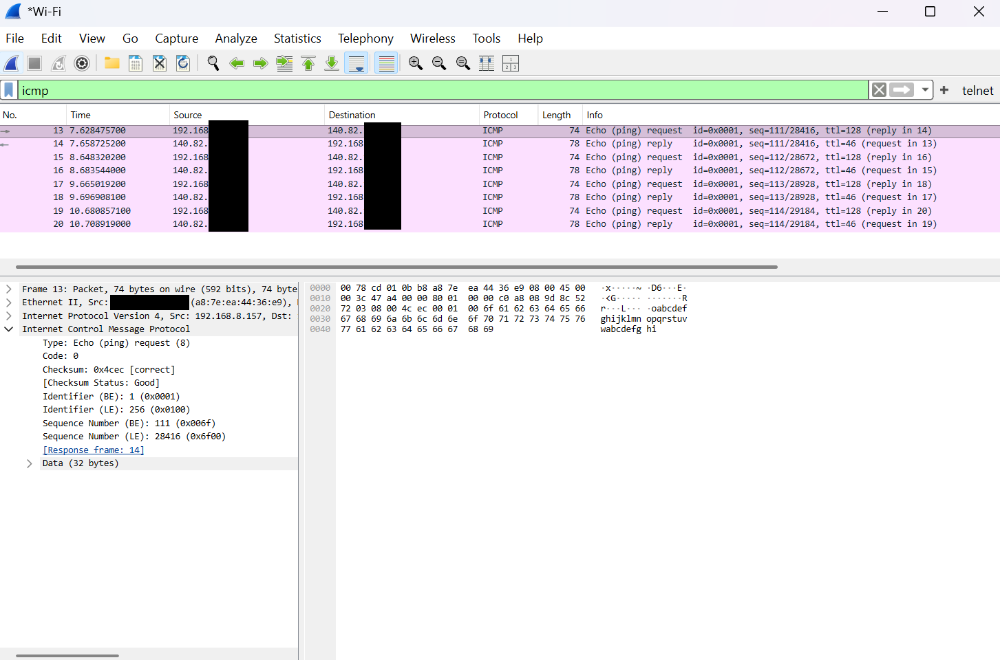
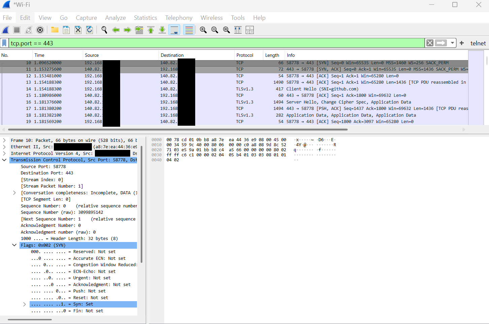
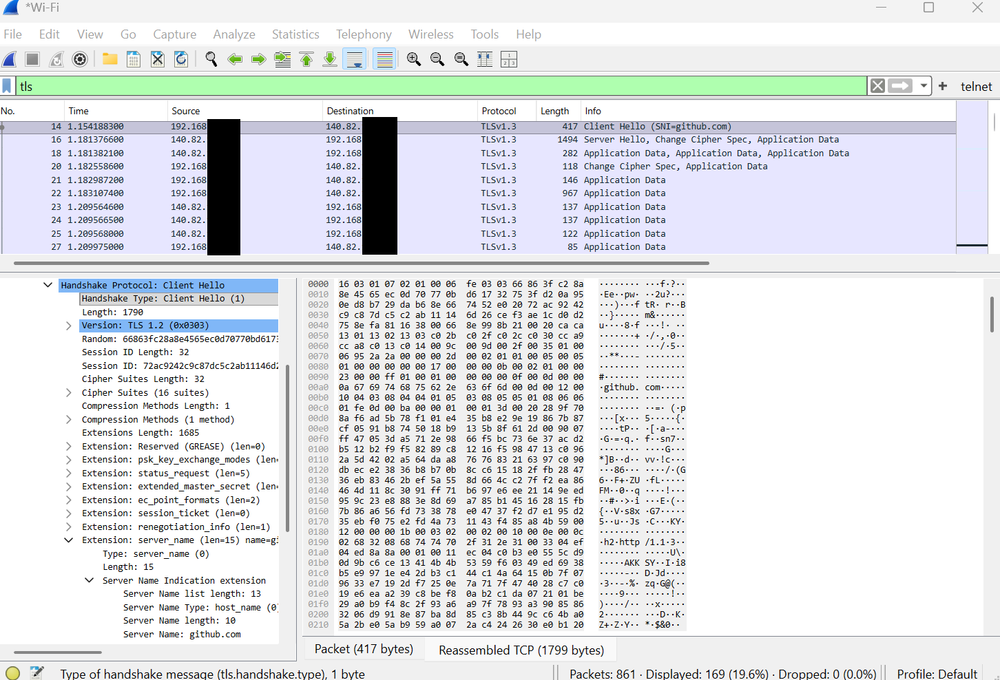

# Network-Analysis-using-Wireshark

## Objective

This project demonstrates the use of Wireshark to capture and analyze network traffic. The objective of this project was to develop a stronger understanding of fundamental networking concepts by observing real network communications and protocols in action.

During the analysis, I examined DNS queries and responses, ICMP traffic generated by ping requests, TCP three-way handshakes, TLS 1.3 handshakes, and traceroute results. Through this process, I gained hands-on experience with how devices communicate across networks and how secure web connections are established.

This project was completed as part of my preparation for entry-level IT Support and Help Desk roles, while also building foundational knowledge for a future career in cybersecurity.

# Repository structure 

```text
wireshark-network-analysis/
│
├── README.md
├── screenshots/
│   ├── dns-query-response.png
│   ├── icmp-echo-request-reply.png
│   ├── tcp-three-way-handshake.png
│   └── tls-client-hello.png
└── captures/
```

# Tools used

- Wireshark - Captured and analyzed network traffic, including DNS, ICMP, TCP, and TLS packets.
- Command Prompt - generated network traffic using commands such as ping, tracert, and ipconfig /flushdns.
- Web Browser - generate real-world web traffic by accessing websites and observing DNS resolution, TCP connections, and TLS handshakes.

# DNS analysis

### Objective

The objective of this analysis was to observe how domain names are resolved into IP addresses before a connection to a website can be established.

### Observation

To generate DNS traffic, I first cleared the local DNS cache using ipconfig /flushdns and then visited websites using a web browser while capturing packets in Wireshark. After applying a DNS filter, I observed both DNS query and DNS response packets. One of the captured queries showed a request for www.google.com.

### Screenshot



### Findings

The DNS query packet contained the domain name being requested by the client. A corresponding DNS response packet returned the IP address associated with the requested domain. This demonstrated how a device relies on DNS to locate the correct server before initiating a network connection.

By clearing the DNS cache before capturing traffic, I was able to observe the DNS resolution process directly rather than relying on previously cached entries.

Through packet analysis, I observed that DNS communication occurs before TCP and TLS communication, making DNS one of the first steps in accessing a website.

### Key Learning

This analysis helped me understand that DNS acts as a translation service between human-readable domain names and IP addresses used by computers. Without DNS, users would need to manually enter IP addresses to access websites and network services.

# ICMP Analysis

### Objective 

The objective of this analysis was to understand how ICMP is used for network diagnostics and to observe the communication generated by the ping command.

### Observation

While capturing network traffic in Wireshark, I generated ICMP traffic by running the ping command against a public host. After applying an ICMP filter, I observed Echo Request and Echo Reply packets exchanged between the client and the destination host. 

### Screenshot



### findings 

The Echo Request packets were sent from the client to verify that the destination host was reachable. The destination host responded with Echo Reply packets, confirming successful network connectivity. 

The ping reults showed that all transmitted packets were successfully received with no packet loss, indicating that communcation between the client and the destination host was functioning correctly.

By examining the ICMP packets in Wireshark, I was able to observe how network devices use ICMP messages to test connectivity and report network status. 

### Key Learning 

This analysis helped me understand that ICMP is a protocol used for netowrk diagnostics and troubleshooting. I learned how the ping command uses ICMP Echo Replies to verify whether a host is reachable and to identify potential connectivity issues.

# TCP Analysis

### Objective 

The objective of this analysis was to observe how a TCP connection is established between a client and a server before data is exchanged.

### Observation 

While capturing traffic in Wireshark, I visited Github using a web browser and filtered for TCP traffic. I observed the TCP three-way handshake consisting of SYN, SYN-ACK, and ACK packets between the client and the destination server.

One observed connection used the following values:
- Source IP: 192.168.x.x
- Destination IP: 140.82.x.x

### Screenshot



### Findings

The TCP handshake began when the client sent a SYN packet to initiate a connection with the server. The server responded with a SYN-ACK packet, indicating that it received the request and was willing to establish a connection. the Client then sent an ACK packet, completing the three-way handshake.

The destination port was 443, indicating that the connection was being established for HTTPS traffic. The source port was an ephemeral port automatically assigned by the operating system to uniquely identify the connection.

By observing the handshake process, I was able to see how TCP establishes a reliable connection before any application data is transmitted. 

### Key Learning 

This analysis helped me understand how TCP provides reliable communication between network devices. I learned how the TCP three-way handshake establishes a connection and how source and destination ports are used to identify services and individual network sessions. 

# TLS Analysis

### Objective 

The objective of this analysis was to observe how TLS is used to establish a secure and encrypted connection between a client and a server. 

### Observation

After identifying the TCP three-way handshake, I continued analyzing the connection and observed a TLS 1.3 handshake between the client and GitHub. The captured traffic included Client Hello and Server Hello messages, followed by encrypted application data exchanged between the client and server.

The Client Hello packet contained an SNI (Server Name Indication) value of github.com, indicating the hostname the client intended to access. 

### Screenshot



### Findings 

Following the successful TCP connection, the client initiated a TLS handshake by sending a Client Hello packet. This packet began the process of negotiating encryption settings and establishing a secure communication channel.

The server responded with a Server Hello packet, confirming the TLS parameters that would be used for the session. Aftr the TLS negotiation was complated, encrypted Application Data packets were exchanged between the client and server. 

The use of TLS 1.3 demonstrated how modern websites protect data in transit by encrypting communication between clients and servers. 

### Key Learning 

This analysis helped me understand the role of TLS in securing network communications. I learned how TLS builds upon a TCP connection to provide confidentiality, integrity, and authentication for HTTPS traffic. I also learned how SNI allows a client to specify the hostname it is attempting to access when mutliple websites share the same server infrastructure.

# Traceroute Analysis

### Objective 

The objective of this analysis was to observe the network path taken by packets when traveling from the client to a remote destination.

### Observation

Using the Windows tracert command, I traced the route to Github and observed multiple network hops between the client and the destination. The results included both private and public IP addresses, representing different network devices and routing infrastructure along the path.

Some hops returned response times, while others displayed asterisks (* * *), indicating that a response was not received from that hop.

### Findings

The traceroute results demonstrated that network traffic passes through multiple routers before reaching its destination. The initial hops contained private IP addresses associated with local or provider-managed network infrastructure, while later hops contained public IP addresses used on the internet. 

The presence of asterisks did not necessarily indicate a connectivity problem. Instead, it suggested that certain routers were configued not to respond to traceroute requests or were rate-limiting responses.

### Key Learning 

This analysis helped me understand how packets travel across multiple network divices before reaching a destination. I learned how traceroute can be used as a troubleshooting tool to identify network paths, measure latency between hops, and help locate potential connectivity issues.

# Lessons Learned

Through this project, I developed a stronger understanding of fundamental networking concepts by capturing and analyzing real network traffic. 

Key concpets learned include:
- How DNS translates domain names into IP addresses before a connection can be established.
- How ICMP is used for network diagnostics through tools such as ping.
- How TCP establishes reliable communication using the three-way handshake (SYN, SYN-ACK, ACK).
- How source and destination ports are used to identify services and individual network connections.
- How TLS 1.3 establishes encrypted communications for HTTPS traffic.
- How SNI (Server Name Indication) identifies the hostname a client is attempting to access.
- How traceroute reveals the network path and routing devices between a client and destination.
- How Wireshark can be used to analyze and troubleshoot network communications at the packet level.

This project helped bridge the gap between theoretical networking concepts and real-world network traffic analysis.

# Challenges Encountered 

While completing this project, I encountered several challenges that required additional investigation and analysis.

Some of the main challenges included:
- Identifying relevant packets within large amounts of captured network traffic.
- Distinguished between source and destination IP addresses during packet analysis.
- Understanding the purpose of ephemeral source ports used by client devices.
- Following the sequence of packets involved in the TCP three-way handshake.
- Interpreting TLS handshake packets and understanding the role of Client Hello, Server Hello, and encrypted Application Data.

Working through these challenges improved my ability to analyze network traffic and strengthened my understanding of how modern network communications operate.

# Conclusion 

This project provided hands-on experience with capturing and analyzing network traffic using Wireshark. By observing DNS resolution, ICMP communication, TCP connection establishment, TLS encryption, and traceroute results, I gained a practical understanding of how devices communicate across networks. 

The project strengthened my network fundamentals and provided valuable experience that supports my preparation for entry-level IT Support and Help Desk roles while building a foundation for future cybersecurity studies.
